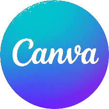

  <h1 style="color: #000000; text-shadow: 2px 2px 4px rgba(0, 0, 0, 0.3); font-size: 3em;">
    Stargazers
  </h1>

  

 ## 💻 About

  This is our console app, a versatile tool that provides valuable information about various space objects and includes calculators for a range of topics.
  With this app, you can explore detailed insights and data on diverse objects, helping you gain a deeper understanding of their characteristics and functionalities.

## 🖊 Used code editor & collaborative service:

    
    
    
    

## 📧 Used tools for our documentation, presentation & communication:

 
 
 
 

 
## 🌐 Languages Used
-  C++

## 💼 Our Team

<a href="https://github.com/PPDimitrov22">Petar Dimitrov</a> (Scrum trainer) 
<a href="https://github.com/PPKovachev22">Petko Kovachev</a> (Front-end Developer) 
<a href="https://github.com/MEDimitrov22">Martin Dimitrov</a> (Front-end Developer) 
<a href="https://github.com/KSPetrov22">Kaloyan Strashimirov</a> (Front-end Developer) 
